+++
date = '2025-05-01T22:04:57+09:00'
draft = false
title = "Sneek peak and initial impressions of Gossamer Gears' Travel Collection"
categories = ['Review']
tags = ['Travel gear']

+++

## Introduction

As someone who:

* Is a trail runner who loves the outdoors and appreciates ultralight gear
* Likes to one-bag travel with just a single backpack for urban travel
* Already owns two Gossamer Gear packs
    * I use the [Vagabond Jet](https://www.gossamergear.com/products/vagabond-jet) for my daily EDC + commute bag and the [Gorilla 50 Ultralight Backpack](https://www.gossamergear.com/products/gorilla-50) for multi-day outdoor expeditions

...I have been waiting for something like Gossamer Gear's Travel Collection; a one-bag-travel oriented collection of gear that embodies Gossamer Gear's philosophy of "Take less, do more".

Gossamer Gear's Travel Collection is set for a global release on 2025-05-06, and Gossamer Gear was nice enough to send me pre-release testing samples of their upcoming Travel collection for testing and review. Although the products were sent by Gossamer Gear, the company had no inputs on my opinions.

Below are some pictures and my initial impressions of the collection.

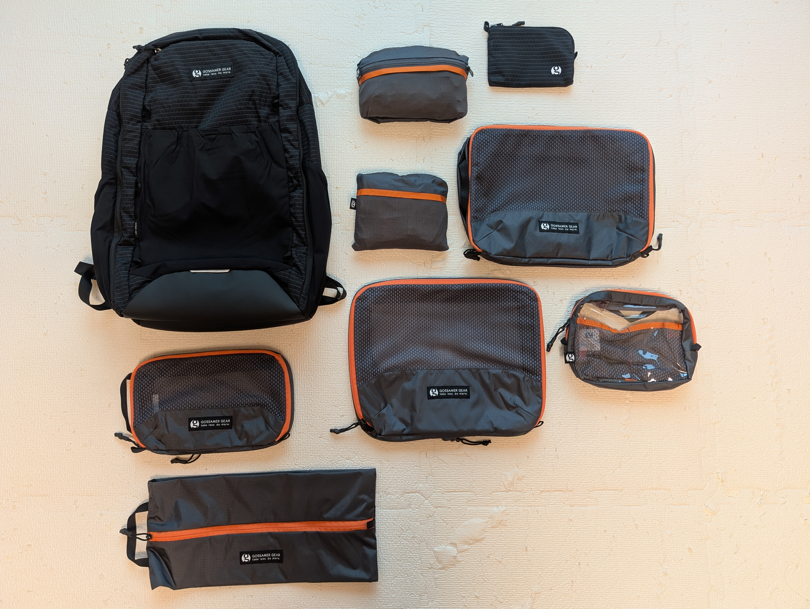

## Travel bags

### Aero Jet Backpack

#### Summary

The Aero Jet Backpack is the main bag of the collection: a clam-shell stype travel backpack that focuses on minimizing weight without sacrificing function.

The main specs of the Aero Jet backpack:

| category | value |
| -- | -- |
| volume | 35L (excluding exterior stretch pockets) |
| weight | 1.13 kg (40 oz) |
| dimensions (W x H x D) | 31.1x52.7x19.1 cm (12.25x20.75x7.5 in) |

The main highlights of the pack are:

* Extremely comfortable harness system with sternum strap and optional hip belt
* Zippered mesh interior with clam-style opening
* One of THE best tech compartments, with holders for a laptop and tablet and a small mesh pocket with a discreet AirTag pocket
* Front stretch mesh pocket
* Dual water bottle pockets
* Hidden pocket with RFID-blocking
* Luggage pass-through

#### Comparments

The Aero Jet has the following compartments:

1. Main compartment
    1. Inner front panel with two large zippered mesh pockets
    2. Main compartment
2. Tech compartment with separate laptop and tablet holder and small mesh pocket
3. Front zippered pocket
4. Front stretch mesh pocket
5. Dual watter bottle pockets
6. Hidden pocket
7. Two stretch mesh pockets on each of the shoulder straps

The main compartment is spacious, and fits the Jet Pack Compression Cubes perfectly:

The pack packed out with the Jet Pack Compression Cubes and Dirty/Clean Cube with about a week's worth of clothes, plus an empty Clear Cube:

The pack's tech compartment is top notch, just like the Vagabond's:

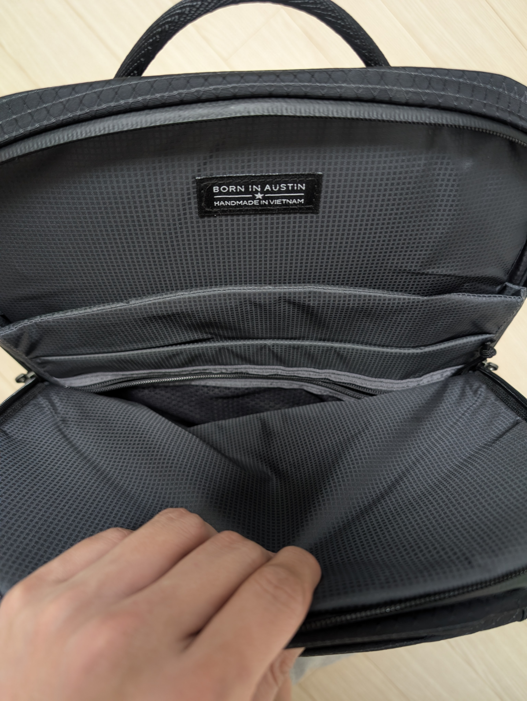

The tech compartment's zipper mesh pocket has a discrete AirTag pocket:

The tech compartment is heavily padded, and is balanced out well. It also has a bit of a false bottom, and that coupled with its padded protection, I have no fear of my laptop and tablet getting damaged. 

After having used the Vagabond Jet as my main commute and EDC bag for more than a year, Gossamer Gear's interpretation of the tech compartment has become one of my favorites. Nothing super fancy, but it completely nails the essentials of protection and weight distribution while being lightweight.

The front stretch mesh pocket is one of my favorite features of my Vagabond Jet, and I'm happy to see it also on the Aero Jet. It's such a convenient location to quickly stash and retrieve low-value items like snacks and tissues. I also like the mesh pockets on the shoulder straps, which I frequently use for holding my Bluetooth earbuds and phone (Pixel 8).

#### Fit and comfort

Like other travel backpacks with similar capacity, the pack is large, and will not make for a good daypack (Fortuantely, Gossamer Gear has an answer for that - read on below). Here's how the pack looks on me (173cm / 5'6"):

Here's how the pack compares to my Vagabond Jet, a 23L bag:

Despite its size, it is an extremely comfortable carry. Gossamer Gear's years of experience of making ultralight outdoor gear shines through in its harness system, and the pack does not dig in at all on the shoulders or on the back.

It is also compatible with the optional [Fastbelt](https://www.gossamergear.com/products/fast-belt) hipbelt, which will help even more with weight distribution while adding some storage. My Fastbelt is on the way, so I haven't had the chance to try out the Aero Jet with the hip belt. Although the pack wasn't fully loaded out, the pack is already supremely comfortable, and I look forward to trying out the Fastbelt with the pack when it arrives.

#### Miscellaneous

The sternum strap is a simple, no-frills buckle-style strap. It's easily height-adjustable, and although I do enjoy the magnetic sternum straps of my other travel backpack (Heimplanet Transit 34L), I also appreciate the lightweight and simple strap of the Aero Jet.

The side grab hadle is well-padded and is comfortable to hold. The top grab handle is identical to that of the Vagabond Jet - secure stitching with a rounded handle that doesn't dig in to your hands while holding it up.

The straps don't come with any fasteners and will dangle out-of-the-box, which is not great. However, I always keep a roll of velcro cable ties around for packs like this, and the loose straps can easily be tidied up with them.

The luggage pass-through is extremely appreciated, and I like how it allows you to sit the bag up straight on a roller suitcase instead of having to lay it down on its side, like on some other packs. 

The hidden security pocket on the back with RFID-blocking is also a great touch and makes for the perfect compartment for your passport while traveling.

Double water-bottle pockets are a must for me, as I always have a 750ml water bottle pocket with me at all times. The extra pocket is often used to hold my daughter's smaller water bottle, or an umbrella on rainy days.

The zippers to the tech compartment and front zippered pocket are aquaguarded, but the zippers of the main compartment are not. They also are not YKK-branded zippers, but they open and close just fine, and I have yet to have any zipper failures on any of my multiple Gossamer Gear products.

#### Conclusion

Overall, the pack is quite minimal and doesn't come with many of creature comforts found in other high-end travel packs such as magnetic straps, stretchy mesh pockets or an advanced admin pocket. But for someone who values simplicity, it feels like a very Gossamer Gear-esque interpretation of the travel backpack, and as a long-time fan of their products, I feel right at home. I love the minimal design language of the pack that still retains the key features that make a good one-bag travel pack, while keeping the pack's base weight to a respectable 1.13 kg.

### RikSak 22L Packable Backpack

The RikSak is a 22L packable backpack that can be used as an ultralight daypack (the answer to the Aero Jet being too big for a daypack) that packs down to a small pocket that fits in the palm of your hand.

The main specs of the RiskSak 22L Packable Backpack:

| category | value |
| -- | -- |
| volume | 20L |
| weight | 139.3 g (4.91 oz) |
| packed dimensions (W x H x D) |17.7x15.2x3.8 cm (7x6x1.5 in) |
| unpacked dimensions (W x H x D) |32.4x53.3x8.9 cm (12.75x21x3.5 in) |

Similar to all packable bags, the pack has minimal compartments or padding, but it has:

* Interior hanging stretch mesh pocket, which the bag folds back into
* Top grab handle

Despite its weight being less than 140g, the pack can hold a lot of volume and will make for a great daypack when walking out and about. As a sucker for packable ultralight gear, I adore this little bag, and I'm sure the RikSak will make for a great addition for travelers.

### Vanish 38L Packable Duffel

The Vanish 38L Packable Duffel is like the bigger brother of the RikSak 22L Packable Backpack. As the name suggests, it's a packable duffel bag that can carry a whopping 38L of stuff, which is already more than what the main Aero Jet can carry (excluding exterior stretch pockets).

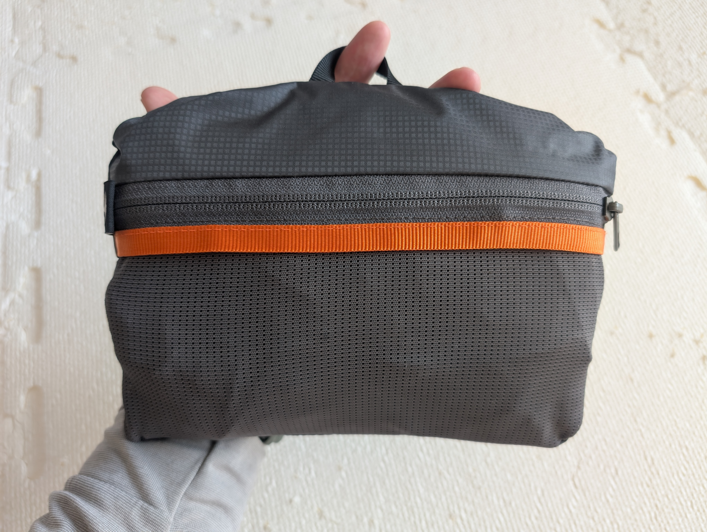

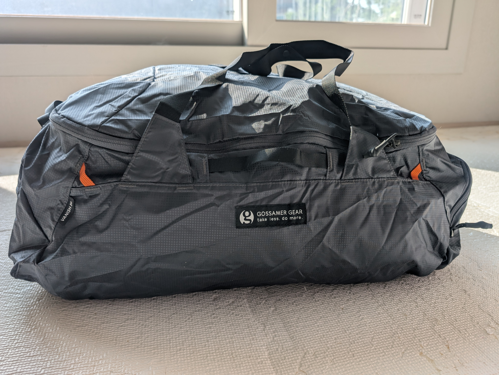

The main specs of the Vanish 38L Packable Duffel:

| category | value |
| -- | -- |
| volume | 38L |
| weight | 213.8 g (7.54 oz) |
| packed dimensions (W x H x D) |21.6x15.9x3.8 cm (8.5x6.25x1.5 in) |
| unpacked dimensions (W x H x D) |53.3x22.9x33 cm (21x9x13 in) |

When I unpacked the Vanish Duffle, I immediately fell in love. The packable duffle bag, despite its low weight of 213g, is incredibly spacious, and will make for the perfect bag for one-baggers like me who like to travel with one-bag, but come back with 1.5/2 bags, with the new bag filled with souveniors and gifts from their travel destination.

It's also surprisingly feature-rich:

* Three convenient, reinforced grab handles
* Attachment points for customization 
* End pockets for extra volume
* Large U-zippered opening 
* Snappable top handles for tote carry, or apart for backpack mode
* A stretch mesh pocket for small items, doubling as the stuff pouch

## Accessories

The accessories are self-explanatory, so I will only include pictures and the specs tables for each, with some exceptions for notable features.

### Jet Pack Compression Cube

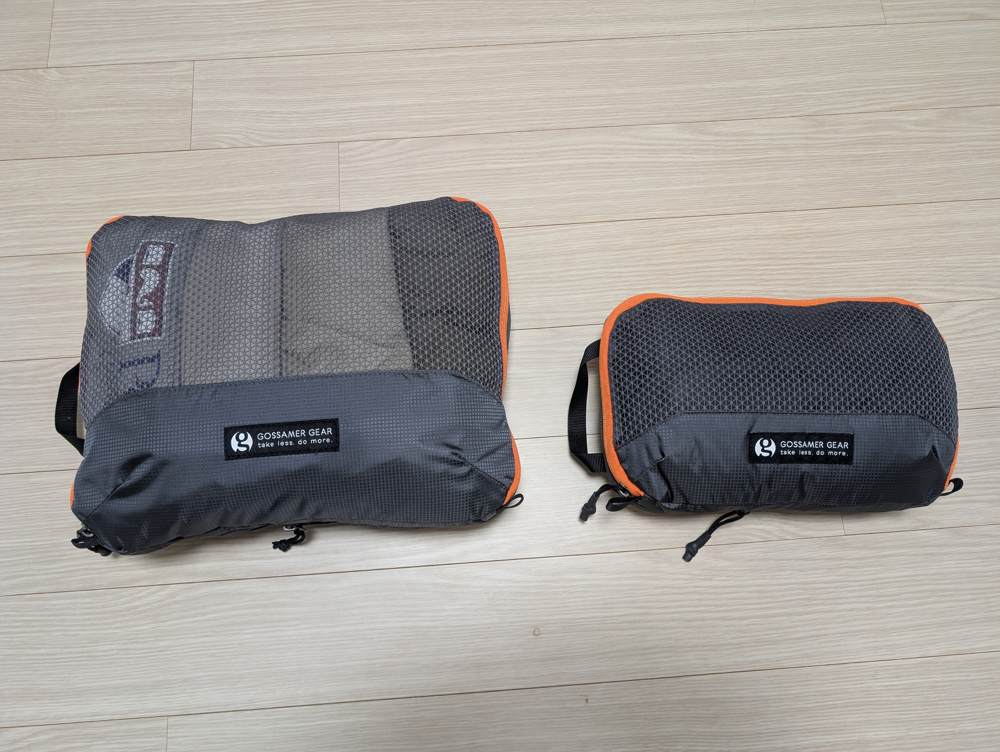

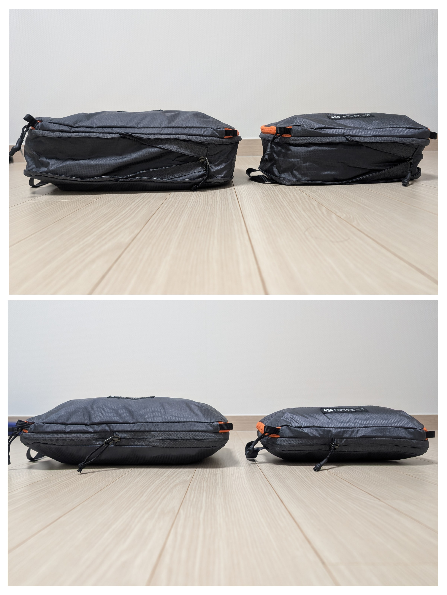

#### Full size

| category | value |
| -- | -- |
| weight | 213.8 g (4 oz) |
| dimensions (W x H x D) |33x27.3x3.8~9.5 cm (13x10.75x1.5~3.75 in) |

#### Half size

| category | value |
| -- | -- |
| weight | 78.5 g (2.77 oz) |
| dimensions (W x H x D) |27.3x16.5x3.8~9.5 cm (10.75x6.5x1.5~3.75 in) |

### Shoe Cube

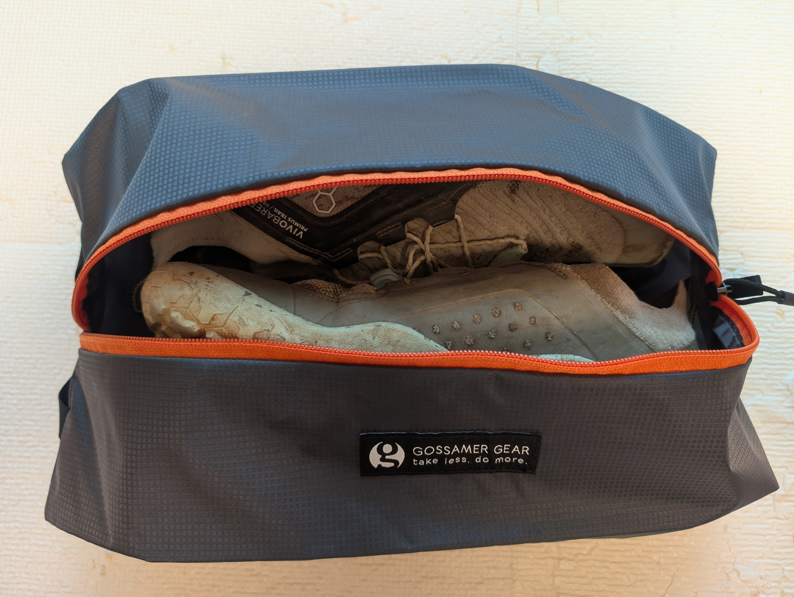

| category | value |
| -- | -- |
| weight | 45 g (1.59 oz) |
| dimensions (W x H x D) |39.4x18.4x9.5 cm (15.5x7.25x3.75 in) |

### Dirty/Clean Cube

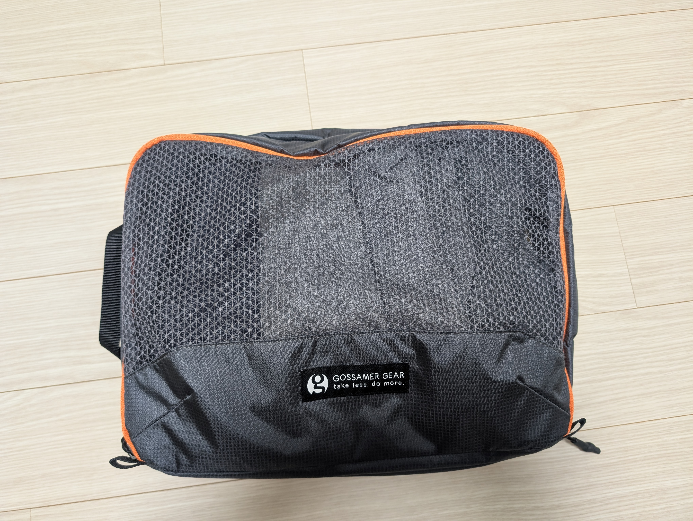

| category | value |
| -- | -- |
| weight | 122.8 g (4.33 oz) |
| dimensions (W x H x D) |39.4x18.4x9.5 cm (15.5x7.25x3.75 in) |

### Clear Cube

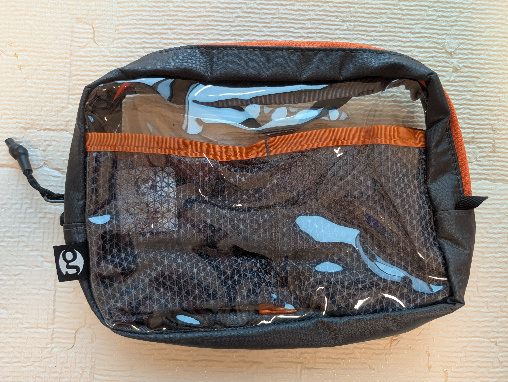

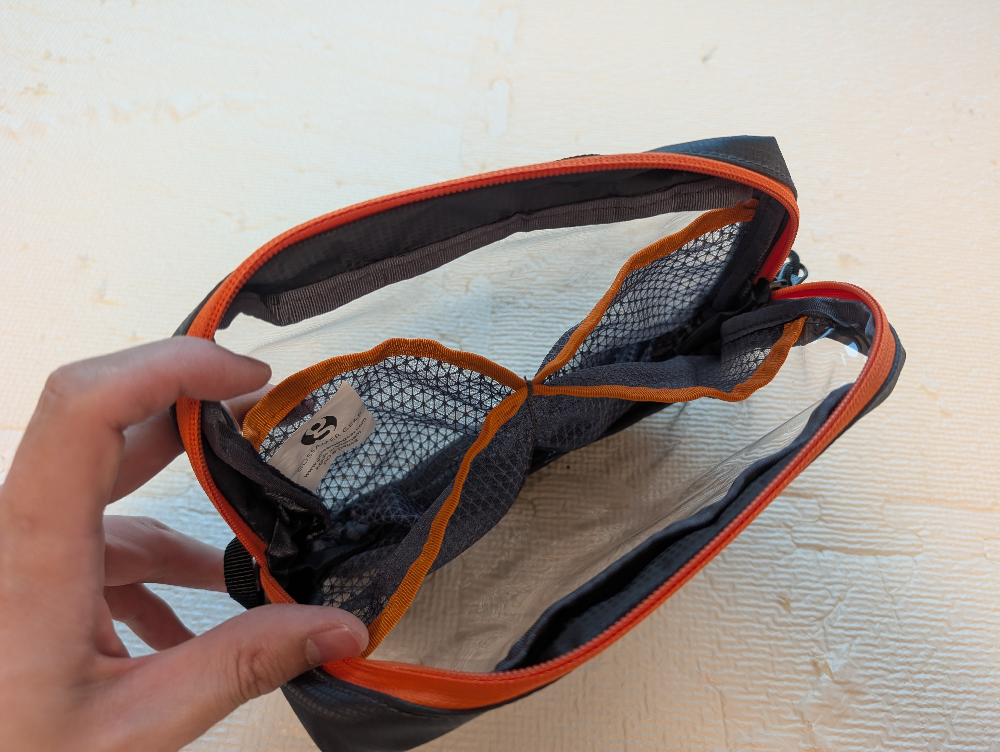

| category | value |
| -- | -- |
| weight | 73.7 g (2.6 oz) |
| dimensions (W x H x D) | 20.3x15.2x6.4 cm (8x6x2.5 in) |

### Passport Wallet

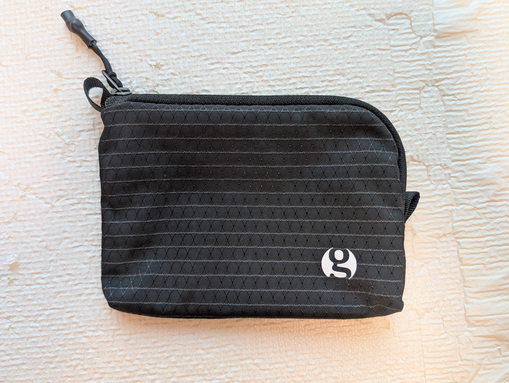

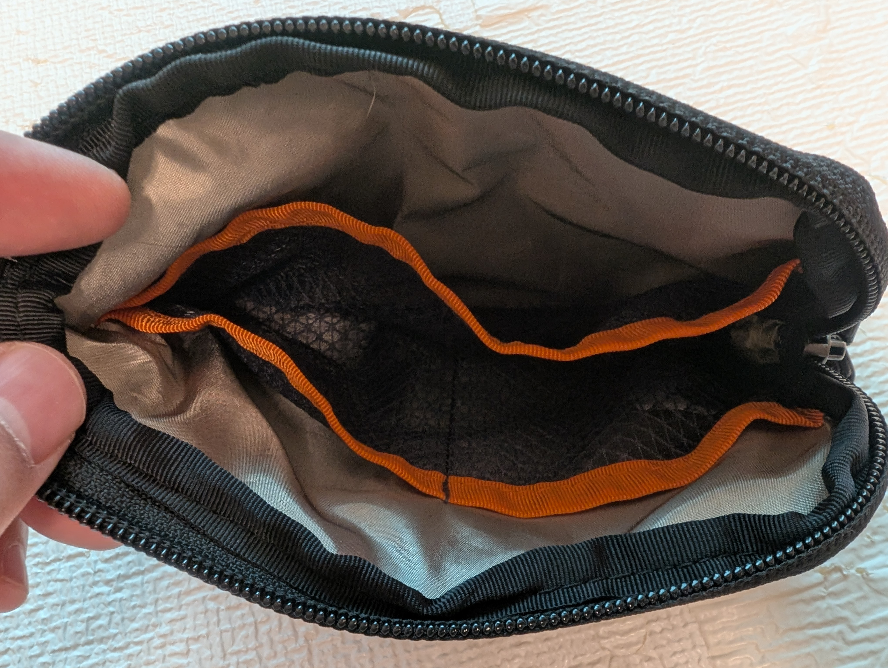

| category | value |
| -- | -- |
| weight | 31.7 g (1.11 oz) |
| dimensions (W x H x D) |15.2x12.1x1.3 cm (6x4.75x0.5 in) |

* Sized to fit one or multiple passports
* RFID-blocking liner
* Two internal card pockets
* One internal pocket for cash

## Comparison with the Heimplanet Transit set

Until now, my urban one-bag travel was done with the Heimplanet Transit lineup, which I have enjoyed using:

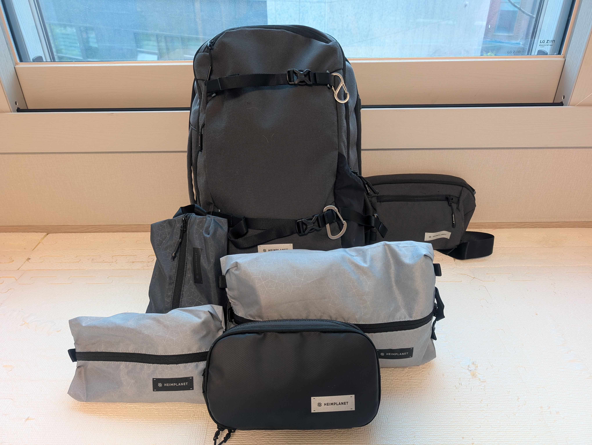

The Heimplanet Transit lineup of products has served me well on my many one-bag trips, however I will be switching to Gossamer Gear's Travel Collection the following reasons:

* It's much lighter, with the Aero Jet weighing at 1.13kg and the Heimplanet Transit 34L at 1.63kg
* The comfort of Gossamer Gear's packs are unmatched
* The tech compartment is amazing
* I like having two water bottle pockets, and I adore the front stretch mesh pocket of Gossamer Gear packs
* Gossamer Gear's ecosystem of accessories, especially the packing cubes, are more feature-rich
* Gossamer Gear's products are more minimal, in a good way
    * For example, while I do appreciate the many features of [Heimplanet's Dopp Kit Better Half](https://en.heimplanet.com/products/carry-essentials-dopp-kit-better-half) such as integrated hanging system and detachable mirror, I personally prefer the no-frills, minimalistic approach of Gossamer Gear's Clear Cube.
* As a trail runner, I prefer the outdoors-inspired look of the Gossamer Gear Aero Jet to the urban-style of the Heimplanet Transit 34L

## Conclusion

As a long-time fan of Gossamer Gear, I may be biased, but my first impression of Gossamer Gear's Travel Collection is that it is FANTASTIC. Gossamer Gear has done a great job of walking the fine line between stripping out the unnecessary while keeping the essentials and staying true to their ultralight roots of "take less, do more". 

I was especially impressed with the comfort of the Aero Jet, the utility of the compressible packing cubes, and how well the two packable bags complement the Aero Jet. I especially didn't expect to be as impressed with the Vanish 38L Packable Duffel as much as I was.

While I haven't had the opportunity to travel with them yet, I have an intercontinental trip coming up in less than 2 weeks, so I look forward to testing them out in the field soon.