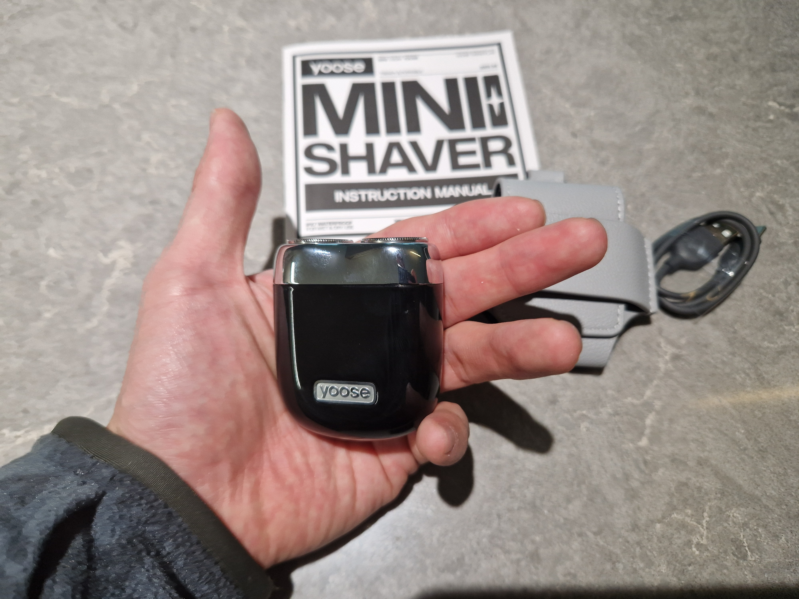
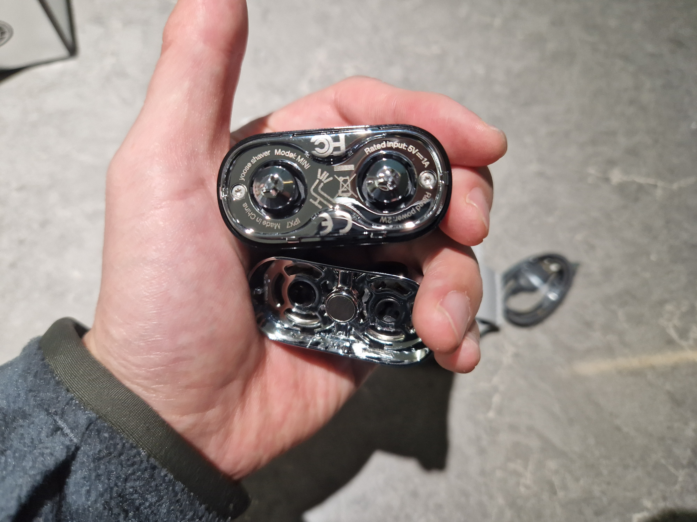
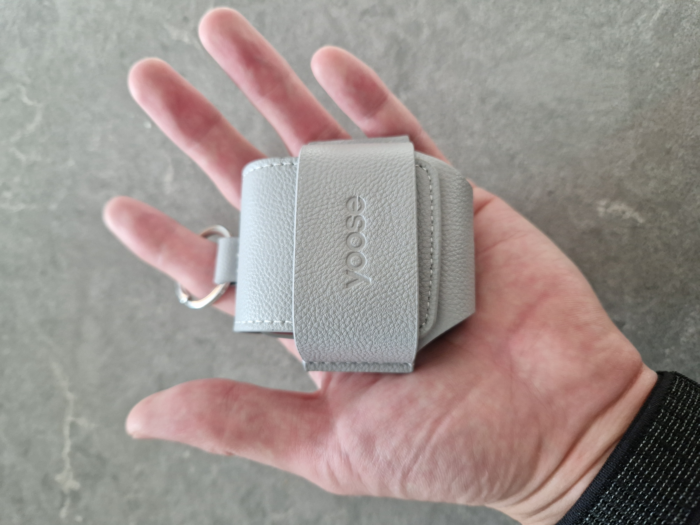
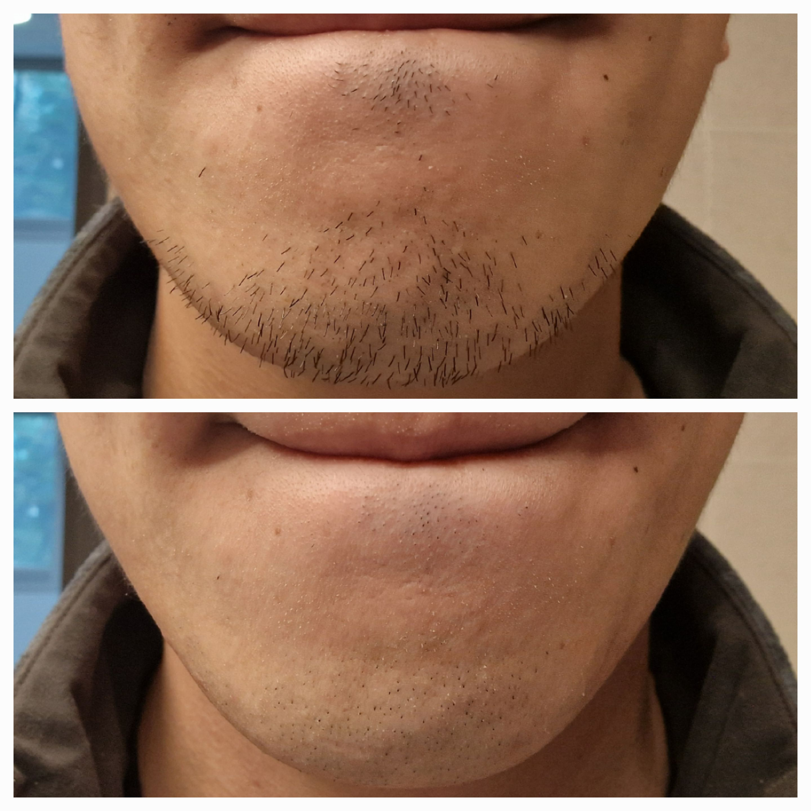

+++
date = '2024-04-03T05:38:26+09:00'
draft = false
title = 'Reivew of Yoose Mini Shaver'
+++

## Summary

The [Yoose Mini Shaver](https://yoosetech.com/products/mini-shaver) is a compact, fully waterproof, USB-C rechargeable electric shaver that lasts for 2 months on a single charge. It can be a bit heavy and may not offer the cleanest shave compared to full-size shavers, but especially for people like me with not too much facial hair, it is more than enough. The shave is pretty great relative for its size, and has made for a great addition to my dopp kit. There are other alternatives out there, but I can highly recommend this one.

## Context

I have been testing out the Yoose Mini Shaver for the last 2 months to see if it is worth adding to my dopp kit. I've been looking for an electric shaver for travel for its convenience, and settled on the Yoose Mini Shaver for the following reasons:

* Compact
* Waterproof
* USB-C rechargeable

I got the shaver on 2023-11-27 and have been waiting until today (2024-04-03) to write this review because the shaver just WOULD NOT DIE! I wanted to include how long the shaver lasts in my review, but it took me more than 2 full months to deplete the shaver's battery, which is wildly impressive.

In anticipation of the shaver, I intentionally grew out my stubble (if you can call it that) for around 5 days to take the below before & after shot:

I was pleasantly surprised at the shave. I honestly wasn't expecting the saver to give me a clean shave given its size, but especially as someone who doesn't have much facial hair, it's more than enough for me. It has more than earned its spot in my dopp kit.  

## Pros vs. Cons

* Pros
    * Compact
    * Waterproof and easy to clean
    * USB-C rechargeable
    * Insane battery life of 2 months on a single charge
    * Clean shave for its size
    * Easy to clean, thanks to its magnetic head attachment
    * Great build quality
    * Great package with carrying case, although I'll probably carry the unit by itself in my dopp kit
* Cons
    * A bit heavy at 147g
    * May not offer the cleanest shave compared to full-size shavers, especially if you have a lot of facial hair
    * Battery isn't user-replaceable
    * Need to buy custom replacement heads (but this is the case for almost all shavers)