+++
date = '2025-04-26T06:15:00+09:00'
draft = false
title = 'Korea 50K race report'
category = ['Trail running']
tags = ['Korea', 'race']
+++

## Summary

| **category**      | **value**                                                      |
| ----------------- | -------------------------------------------------------------- |
| distance_km       | 52.50                                                          |
| elevation_gain_m  | 3,265                                                          |
| peak_elevation_m  | 725                                                            |
| elapsed_time      | 12:14:45                                                       |
| is_race           | TRUE                                                           |
| course_type       | circular                                                       |
| start_location    | Bosan station, line 1                                          |
| finish_location   | Bosan station, line 1                                          |
| start_has_lockers | FALSE                                                          |
| garmin_link       | [link](https://connect.garmin.com/modern/activity/18938427221) |

## The course

The race, Korea 50K, is one of Korea's few international trail running races. Held in Dongducheon north of Seoul, it first started in 2015. The 2025 50K was my first official 50K ultrmarathon, although I have done 100K ultras in the past.

Officially, the course is 52.50KM with a total elevation gain of 3,265m, which goes through 3 major mountains. The race also offered 4 aid stations throughout the course.

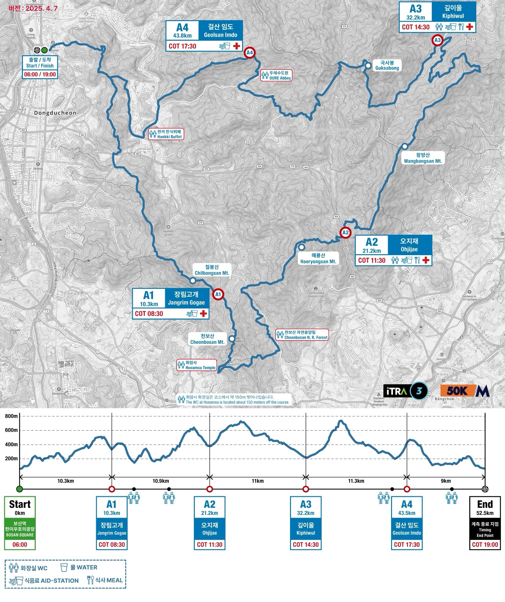

Although the first 20K were quite runnable, the later half was quite technical, and it had ascents where I had to literally crawl on all fours as well as descents where I had to slowly shimmy sideways to not fall over. Overall, I would say it was about a 4 out of 5 for the terrain's technical level.

## Gear shakedown

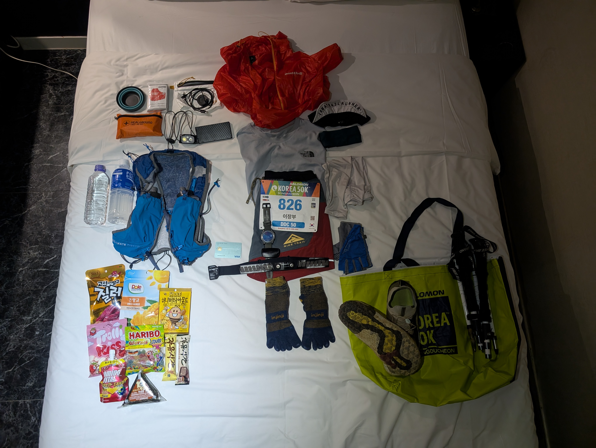

The gear I used for the race is below:

| **category** | **item**                           |
| ------------ | ---------------------------------- |
| clothing     | Motbell EX Light Wind Jacket       |
| clothing     | The North Face T-shirt             |
| clothing     | Nike Trail shorts                  |
| clothing     | Injinji Trail Midweight Mini-Crew  |
| clothing     | Vivobarefoot Primus Trail Knit FG  |
| clothing     | Mesh cap                           |
| clothing     | Lululemon Metal Vent Tech Headband |
| clothing     | Fingerless gloves                  |
| clothing     | Arm sleeves                        |
| tech         | Garmin Epix Pro Gen 2 47mm         |
| tech         | Garmin HRM Dual strap + monitor    |
| tech         | Nitecore NB10000 Gen 3 power bank  |
| tech         | Nitecore NU25 UL Headlamp          |
| tech         | Bose Ultra Open Earbuds            |
| tech         | USB-C to USB-C cable               |
| tech         | Garmin charging puck               |
| gear         | Ultimate Direction Ultra Vest 6.0  |
| gear         | Gossamer Gear Storage Sack, Small  |
| gear         | Trekking poles                     |
| gear         | Sea to Summit Frontier Cup         |
| gear         | First aid kit                      |
| gear         | Survival blanket                   |
| food         | Beef jerkey                        |
| food         | Chocolate bars                     |
| food         | Jelly                              |
| food         | Almonds                            |
| food         | Amino acid drink                   |
| misc.        | Debit card                         |

There were some safety equipment required by the race that I didn't use, and I didn't finish all my food thanks to there being plenty of food available at the aid stations, but overall I didn't overpack and felt good about my gear.

## Planning the run

Prior to race day, I had planned out two target times for myself:

1. Ambitious - 9:00:00
2. Comfortable - 9:45:00

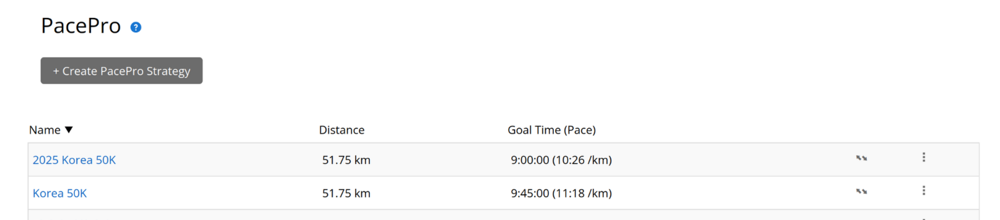

I had based these times on the fact that I had done the first 50K of [Mt. Bukhan Trail](https://www.jangboolee.com/posts/running/mt-bukhan/) in about 9:35. If I felt good on the morning, I would try for the ambitious target time of 9 hours, but shoot for the comfortable time of 9:45 if I didn't.

Since the Mt. Bukhan Trail attempt was a run that I had done with no real time pressure, I assumed that I would be able to push myself a bit further on race day. It turned out that I had grossly underestimated the terrain of the trail (more to follow)...

## Pre-race check-in

I got to Bosan station the evening of the race, as racers could start checking in a day before the race. When I got there at around 18:00, the area was full of trail runners, and I felt right at home with my people.

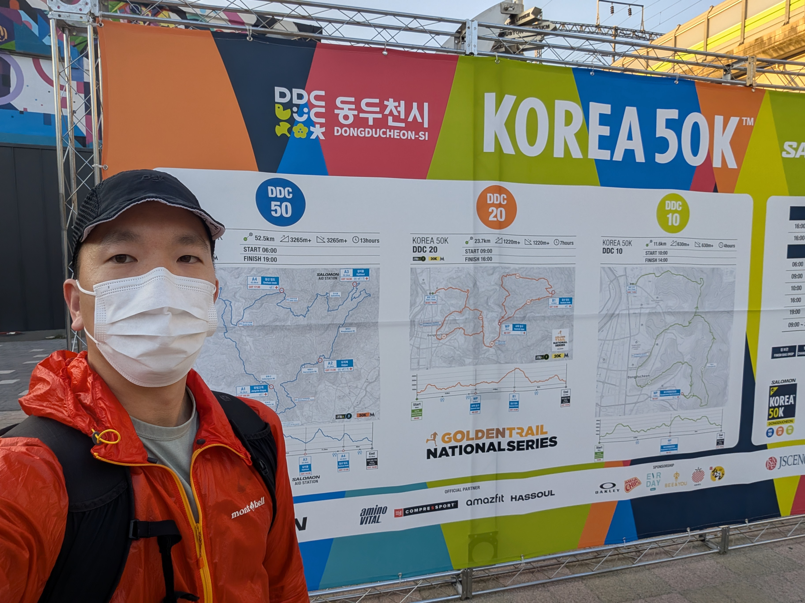

I scanned a QR code to virtually que for check-in, and since I had some time to kill, I walked around the venue and visited some pop-up booths of some of my favorite running brands, especially the Garmin booth.

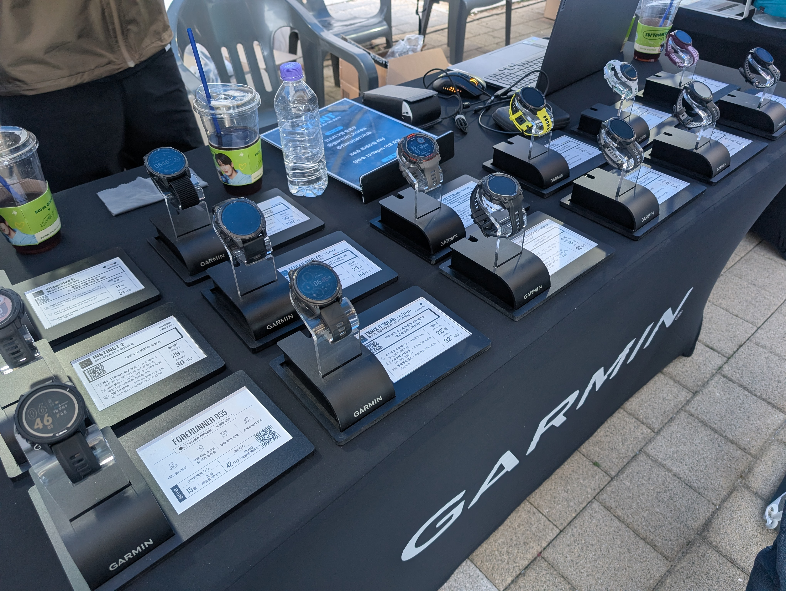

After checking in, I received my bib (#826), and I went to a nearby motel to rest and get ready for the race.

## The run

### Race-day morning

I unfortunately couldn't sleep very well the night before, so I woke up feeling tired, especially since I hadn't been able to get much sleep for the last couple of weeks, getting an average of around 6 hours of sleep per day.

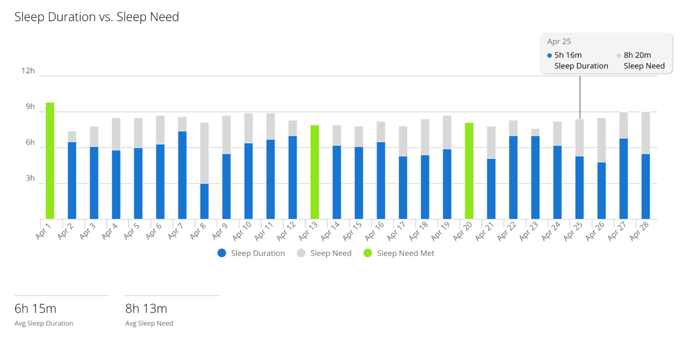

Despite my poor sleep, I was excited to run the ultra, and I decided to shoot for the ambitious target of 09:00. 

I checked-out from the motel at around 05:20 to check in my bag before the 06:00 starting time. After checking in my bag, I headed to the starting line at 05:45, which was already packed with runners by then.

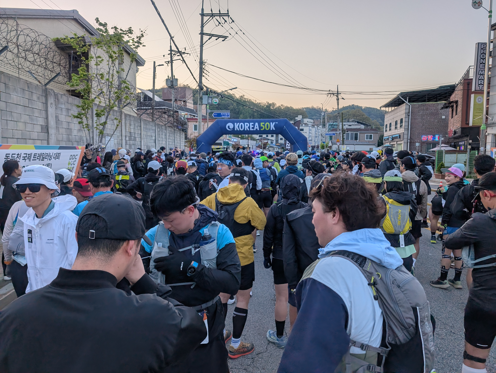

While waiting for the starting gun, I couldn't help but notice that I was the only runner wearing minimal shoes (that I could see), and most were wearing maximalist shoes. Different strokes for different folks, but I personaly think that everyone can benefit from incorporating minimalist shoes to strengthen the feet and legs and to get attuned to listening to your feet's sensory receptors. Plus, feeling the ground while running is fun!

The race ended up getting delayed by around 15 minutes, but at 06:15, the countdown started, and everyone was off to the races.

### First leg

After about 1.5K of pavement, we soon reached the start of the trail, where the runners were bottlenecked from the starting point of the singletrack trailhead.

But soon after, the bottleneck started to clear out, and the runners were finally able to start actually trail running in the beautiful mountains.

It was my first time running in the mountains in Dongducheon, and it had some gorgeous views.

The first leg was very runnable, with the grades of the trail not beeing too steep, which made for a great trail running experience. After running about 10.5K in 1 hour and 55 minutes, I reached the first aid station. At this point, I was actually ahead of my target time of 9:00 by a couple minutes.

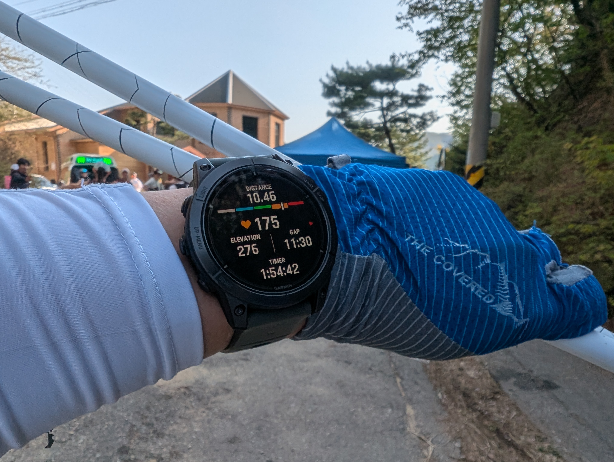

I was running at a pretty good pace, but my Garmin was telling me that I was running with an average HR in the mid-to-high 180bpm. This was _definitely_ not how I should be pacing myself during the first 2 hours of a 50K ultra, but but my HR-Dual monitor had sporadically been giving strange readings recently, and I genuinely felt like I was running at around 160bpm. So I chalked it up to some miscalibration issue with my HR monitor and decided to keep running at the same pace. 

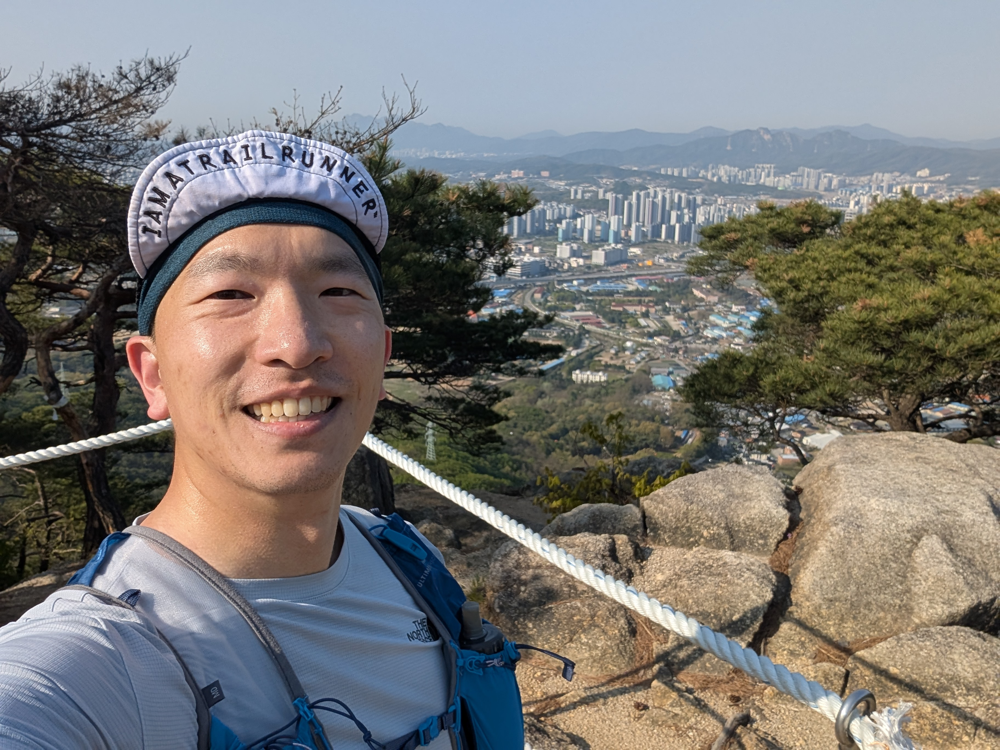

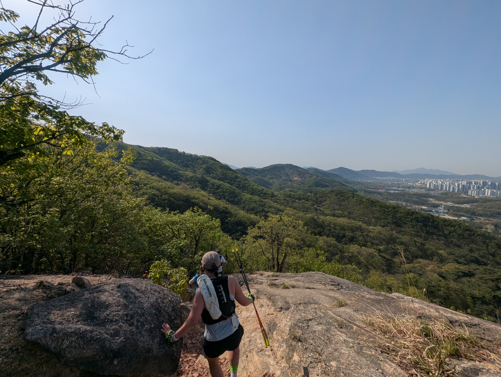

At this point, some of the ascents started getting quite steep and technical, to the point where I had to crawl on all fours to get myself up the trail. The rise in the trail's technical levels started to get to me, and I decided to adjust my target goal to the more comfortable 09:45. 

So I tried to stop my ongoing PacePro plan of 09:00 and restart my alternative PacePro plan of 09:45, and that's when disaster struck at around the 16K mark.

### Garmin malfunction

On a Garmin device, you can stop and resume your course navigation mid-activity at any time. I had assumed that PacePro Plans would be similar, and that you can stop a PacePro Plan and start a new PacePro Plan during the same activity. Unfortunately, I was mistaken.

After I realized that my initial target of 09:00 was too ambitious for the trail's terrain, I stopped my 09:00 PacePro Plan and tried to start my alternative 09:45 PacePro Plan. Unfortunately, I couldn't find the option to start a new PacePro Plan mid-activity, so I thought that it would be better to just continue using the previous 09:00 plan. To try to force my watch to resume the PacePro I just exited, I went back to the watch face, into my race calendar glance, and clicked the `Use PacePro` option under the Korea 50K race event.

Apparently my Epix didn't like that, and it started creating multiple laps in succession within the trail run I activity I had been tracking, and then...froze. No matter what I did, the watch did not respond, and then after a couple minutes, did a soft reboot on its own. When it rebooted, it pulled up the trail running activity, but with everything reset to 0.

As a Garmin and data nerd who believes "If it's not on Garmin, it didn't happen", this was a huge mental blow, since I thought that I had lost the first 16K of the 50K race. Distraught, I restarted my activity from scratch, and started re-tracking my run from scratch.

This meant that I could no longer easily track my total distance or total elapsed time, which made pacing myself extremely difficult. I could technically do some mental math of `51K - remaining_distance = total_distance` and `current_time - 06:15 = total_elapsed_time` to figure them out, but in an ultra, you don't have much headspace for much else besides taking the next step. 

As I was still mid-race, I also couldn't take the time out to figure out exactly what happened, but I was heartbroken to see that my watch's activity history didn't show the first 16K of the race. For all I knew, it was gone, and I could only track the remaining 35K.

This Garmin malfunction, combined with the fact that I had been running with an average heart rate of around 180bpm for the last 4 hours, took a heavy toll on my motivation levels.

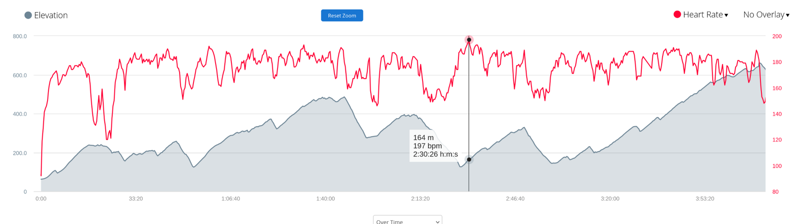

### The darkness

### The final stretch

## Lessons learned

## Closing thoughts