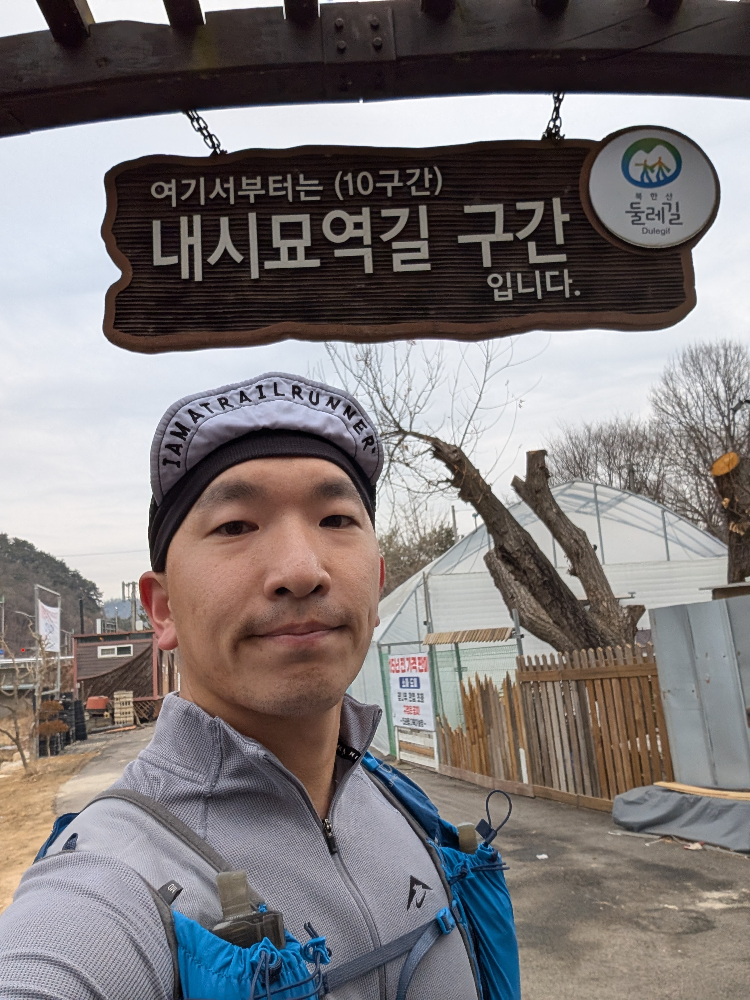

+++
date = '2025-02-28T10:00:00+09:00'
draft = false
title = 'Mt. Bukhan trail 64K solo run'
category = ['Trail running']
tags = ['Korea', 'solo']
+++

## Summary

| **category**      | **value**                                                      |
| ----------------- | -------------------------------------------------------------- |
| distance_km       | 64.62                                                          |
| elevation_gain_m  | 3,255                                                           |
| peak_elevation_m  | 353                                                            |
| elapsed_time      | 12:55:45                                                       |
| is_race           | FALSE                                                          |
| course_type       | circular                                                       |
| start_location    | Bulgwang station, line. 3/6                                    |
| finish_location   | Bulgwang station, line. 3/6                                    |
| start_has_lockers | TRUE                                                           |
| garmin_link       | [link](https://connect.garmin.com/modern/activity/18398774589) |

## The course

The course, called 북한산 둘레길 in Korean, is about 64KM long and goes around the circumference of Mt. Bukhan, a national park in Korea:

Its elevation profile is not too steep, with a combined ascent of 3,255m with the peak of the course reaching  353m at around the 24K mark.

The course has 21 official segments, with each segment containing a photo spot where you can take a selfie to prove your attempt. Although [the program](https://www.knps.or.kr/portal/dulegil/bukhansan/stamptour.do) is now discontinued, you could get a passport book, where if you get your selfie at each of the 21 photo spots verified at a visitor center, you could get a stamp and a little souvenior badge.

Overall, the course is not very rocky or technical and is very runnable. There is about 10K to 15K of road, but the course is mostly trail. It's very well-marked, and it's difficult to get lost. There's several convenience stores throughout the course where you can refuel and restock. There's also several public bathrooms throughout the course.

The official course website can be found [here](https://www.knps.or.kr/portal/dulegil/bukhansan/index.do), and below is the high-res official Korean map.

## Gear shakedown

The gear used for the adventure is below:

| **category** | **item**                           |
| ------------ | ---------------------------------- |
| clothing     | Motbell EX Light Wind Jacket       |
| clothing     | Montbell Trail Action Jacket       |
| clothing     | Nike Trail Longsleeves             |
| clothing     | Nike Trail shorts                  |
| clothing     | Injinji Trail Midweight Mini-Crew  |
| clothing     | Vivobarefoot Primus Trail Knit FG  |
| clothing     | Mesh cap                           |
| clothing     | Lululemon Metal Vent Tech Headband |
| clothing     | Fingerless gloves                  |
| tech         | Garmin Epix Pro Gen 2 47mm         |
| tech         | Garmin HRM Dual strap + monitor    |
| tech         | Nitecore NB10000 Gen 3 power bank  |
| tech         | Nitecore NU25 UL Headlamp          |
| tech         | Shokz OpenFit                      |
| tech         | USB-C to USB-C cable               |
| tech         | Garmin charging puck               |
| gear         | Ultimate Direction Ultra Vest 6.0  |
| gear         | Gossamer Gear Storage Sack, Small  |
| gear         | Trekking poles                     |
| food         | Beef jerkey                        |
| food         | Clif bar                           |
| food         | Jelly                              |
| food         | Salt candy                         |
| misc.        | Debit card                         |
| misc.        | Mt. Bukhan Stamp Tour Passport     |

I used every single piece of gear that I took with me and never found myself wanting for more, so the gear preparation for this adventure was perfect.

## Pre-run, segment 21

Segments 1 to 20 go around the circumference of the mountain, but there is one other segment that goes through the mountain: segment 21. 

I had considered doing all segments including 21 in a single loop, but the logistics of having to start and end at two different locations was too complicated, so I opted to do segment 21 separately. Which is what I did on 2024-12-14. 

Segment 21 is unique in that it has a quota of allowed visitors per day, and you need to make a reservation in advance on the [Korea National Park Service website](https://reservation.knps.or.kr/trail/searchTrailReservation.do?prd_id=TB141XXX01).

The course is a very steady uphill and downhill with a total elevation gain of around 220m that can easily be done in under an hour.

With segment 21 completed in advance, I was ready to tackle the remaining 20 segments.

## The run

I got to Bulgwang station at a bit over 6, and after putting my belongings in the station's locker, I walked about 10 minutes from exit 2. At around 07:00, I started the run at the beginning of segment #8.

After about 15 minutes, I reached the photo zone of segment 8, with some beautiful views of the mountain.

After a short descent, I passed Eunpyeong Hanok Village to enter segment 9 and 10, which were mostly road.

Segments 11 and 12 went through some remote trail sections with some more beautiful views of the mountaintops.

Segment 13 went through a short road segment, and I then entered segment 14, which offered another panoramic view of the mountain.

After completing segment 15, I reached the 30K mark after about 5 hours and 20 minutes, which was roughly the half-way point of the course. 

At around the mid-way point of segment 17, I came across a majestic temple with the mountains as its backdrop, which was a sight to behold.

Segment 19's photo spot was a lookout tower, from which I was able to get some breathtakingly beautiful views of the mountain.

I soon passed the 42.195KM mark, the official marathon distance, after about 8 hours of scrambling through the monutains.

I then reached segment 1, where I stopped by a convenience store to restock on hydration and food. Then midway through segment 3, I reached the 50K mark after about 9 hours and 35 minutes.

I started to really feel it by this point, where every 1K felt like 10K, but I could practically see the finish line, so I kept chuggling along.

The sun started to set about the time I hit the photo spot of segment 5, and it started to get dark from the start of segment 6. Segment 6 was all road with streetlights, but I still took out my headlamp for road safety. 

I soon reached the beginning of segment 7, the last segment of the course. Segment 7 was trail again, and I had to do the last segment guided only by the light of my headlamp. I had trained running in the dark, but it's always a bit scary yet strangely comforting to know that you are completely alone in the mountain.

After finishing up the last segment, I could see my original starting location, so I ran as fast as my tired legs would go back to the finishing location, completing my solo run of the entire 64KM loop of Mt. Bukhan trail in 12:55:44.

This was a run that I had wanted to do for so long, and I was overjoyed to finally cross it off my running bucket list.

## Mt. Bukhan, revisited

As mentioned in the [the course section](https://www.jangboolee.com/posts/running/mt-bukhan/#the-course), you could get your effort officially verfied and certified with the now-discontinued stamp program by taking your copy of the photo passport and showing your selfies at each photo spot to one of the national park's visitor center.

Which is exactly what I did on 2025-03-08. After reserving segment 21 again, I once again started at segment 7, then stopped by at the visitor center at the middle of segment 10. I then continued running until the middle point of segment 12, which is where it converges with segment 21. Then I ran segment 21 to finish at Bukhansan Ui and took the train back home. Since this was a point-to-point course, I carried all my stuff with me throughout the run.

At the visitor center at segment 10, I showed the staff member all my selfies and my Garmin activity log, and she verified that I had indeed done the entire course. I was allowed to fill out my stamp passport, and after taking a ceremonious picture, I got a cute little stamp as a souvenior.

Although it's a bummer the program is discontinued, I was glad I got to take advantage of it while I could, and the program was a great way to gamify an already fun and rewarding experience.

The Mt. Bukhan trail is my favorite trail system in Seoul, and I highly recommend giving the trail a visit if you ever get a chance to visit Seoul.