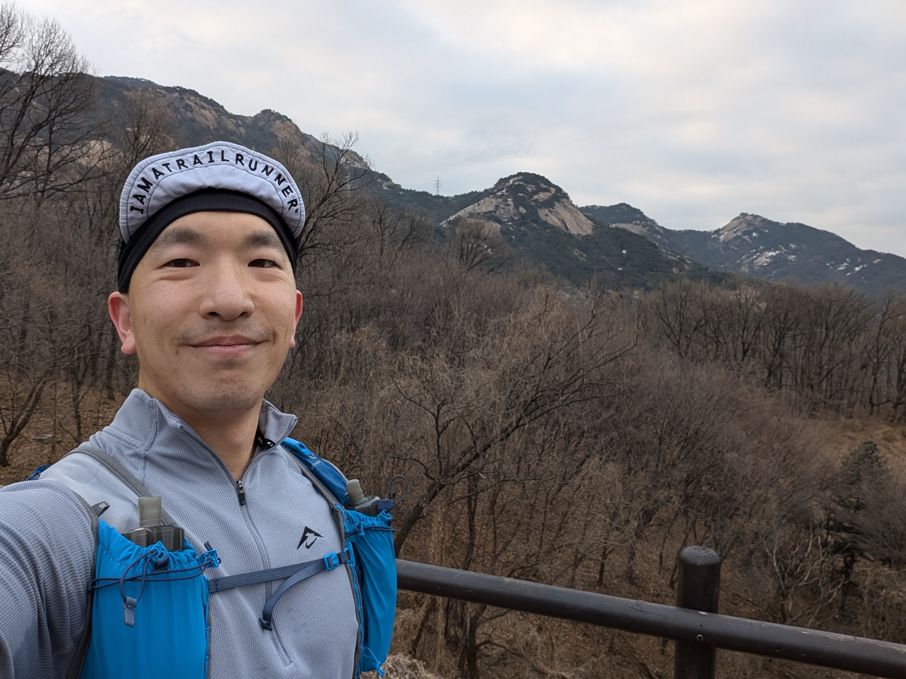

+++
date = '2025-02-28T10:00:00+09:00'
draft = false
title = 'Mt. Bukhan trail 64K solo run'
category = ['Trail running']
tags = ['Korea', 'solo']
+++

## Summary

| **category**      | **value**                                                      |
| ----------------- | -------------------------------------------------------------- |
| distance_km       | 64.62                                                          |
| elevation_gain_m  | 3255                                                           |
| peak_elevation_m  | 353                                                            |
| elapsed_time      | 12:55:45                                                       |
| course_type       | circular                                                       |
| start_location    | Bulgwang station, line. 3/6                                    |
| finish_location   | Bulgwang station, line. 3/6                                    |
| start_has_lockers | TRUE                                                           |
| garmin_link       | [link](https://connect.garmin.com/modern/activity/18398774589) |

## The course

The course, called 북한산 둘레길 in Korean, is about 64KM long and goes around the circumference of Mt. Bukhan:

Its elevation profile is not too steep, with a combined ascent of 3,255m with the peak of the course reaching  353m at around the 24K mark.

The course has 21 official segments, with each segment containing a photo spot where you can take a selfie to prove your attempt. Although the program is now discontinued, you could get a passport book, where if you get your selfie at each of the 21 photo spots verified at a visitor center, you could get a stamp and a little souvenior badge.

Overall, the course is not very rocky or technical and is very runnable. There is about 10K to 15K of road, but the course is mostly trail. It's very well-marked, and it's difficult to get lost. There's several convenience stores throughout the course where you can refuel and restock. There's also several public bathrooms throughout the course.

The official course website can be found [here](https://www.knps.or.kr/portal/dulegil/bukhansan/index.do), and below is the high-res official Korean map.

## Gear shakedown

The gear used for the adventure is below:

| **category** | **item**                           |
| ------------ | ---------------------------------- |
| clothing     | Motbell EX Light Wind Jacket       |
| clothing     | Montbell Trail Action Jacket       |
| clothing     | Nike Trail Longsleeves             |
| clothing     | Nike Trail shorts                  |
| clothing     | Injinji Trail Midweight Mini-Crew  |
| clothing     | Vivobarefoot Primus Trail Knit FG  |
| clothing     | Mesh cap                           |
| clothing     | Lululemon Metal Vent Tech Headband |
| clothing     | Fingerless gloves                  |
| tech         | Garmin Epix Pro Gen 2 47mm         |
| tech         | Garmin HRM Dual strap + monitor    |
| tech         | Nitecore NB10000 Gen 3 power bank  |
| tech         | Nitecore NU25 UL Headlamp          |
| tech         | Shokz OpenFit                      |
| tech         | USB-C to USB-C cable               |
| tech         | Garmin charging puck               |
| gear         | Ultimate Direction Ultra Vest 6.0  |
| gear         | Gossamer Gear Storage Sack, Small  |
| gear         | Trekking poles                     |
| food         | Beef jerkey                        |
| food         | Clif bar                           |
| food         | Jelly                              |
| food         | Salt candy                         |
| misc.        | Debit card                         |
| misc.        | Mt. Bukhan Stamp Tour Passport     |

I used every single piece of gear that I took with me and never found myself wanting for more, so the gear preparation for this adventure was perfect.

## The run

I got to Bulgwang station at a bit over 6, and after putting my belongings in the station's locker, I walked about 10 minutes from exit 2. At around 07:00, I started the run at the beginning of segment #8.

After about 15 minutes, I reached the photo zone of segment #8, with some beautiful views of the mountain.

